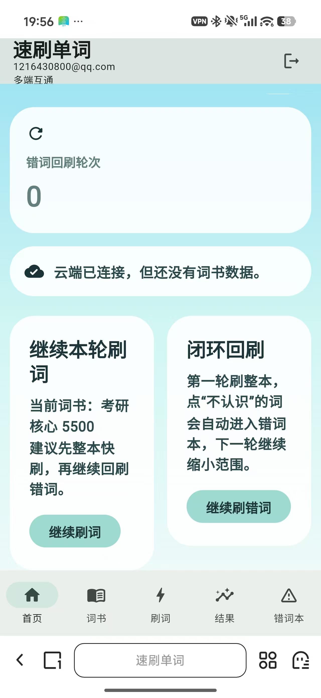

# 速刷单词 Rapid Word

> 一款面向考前冲刺和高频回刷的单词学习应用。

[](https://rapid-word.vercel.app)
[](https://docs-six-nu.vercel.app)
[](https://github.com/Qzy-art/rapid-word-flutter/releases)
[](https://github.com/Qzy-art/rapid-word-flutter/blob/main/LICENSE)

[在线体验 Web 版](https://rapid-word.vercel.app) | [实操手册站](https://docs-six-nu.vercel.app) | [GitHub 仓库](https://github.com/Qzy-art/rapid-word-flutter)

它不是传统那种重流程背词 App，而是尽量把交互压到最短：用户只需要快速判断 `认识` 或 `不认识`，把不会的词自动沉淀到错词本，再通过多轮回刷逐步清空。

## 快速入口

- 在线体验：[https://rapid-word.vercel.app](https://rapid-word.vercel.app)
- 下载 Windows 版：[GitHub Releases](https://github.com/Qzy-art/rapid-word-flutter/releases)
- 文档手册：[https://docs-six-nu.vercel.app](https://docs-six-nu.vercel.app)
- 源码仓库：[https://github.com/Qzy-art/rapid-word-flutter](https://github.com/Qzy-art/rapid-word-flutter)
- 下载方式：当前支持在线直接使用，也支持通过 GitHub Releases 下载 Windows 压缩包
- 开源协议：`MIT`

## 在线地址

- App（正式地址）：[https://rapid-word.vercel.app](https://rapid-word.vercel.app)
- 文档手册站：[https://docs-six-nu.vercel.app](https://docs-six-nu.vercel.app)
- GitHub 仓库：[https://github.com/Qzy-art/rapid-word-flutter](https://github.com/Qzy-art/rapid-word-flutter)
- Windows 下载页：[https://github.com/Qzy-art/rapid-word-flutter/releases](https://github.com/Qzy-art/rapid-word-flutter/releases)

## 功能概览

- `认识 / 不认识` 双按钮快速刷词
- 错词自动收集与多轮回刷
- 词书管理：新建、切换、编辑、导入
- 手动添加单词与批量导入
- Supabase 账号登录与数据同步
- Windows 桌面版与 Web 版双端运行
- 已部署在线网页，手机浏览器可直接访问

## 项目截图

### 首页



### 词书页


### 刷词页


## 当前状态

当前项目已经完成：

- Flutter 项目骨架搭建
- Windows 桌面端运行
- Flutter Web 运行与上线
- Supabase 登录与数据库接入
- 词书、刷词、结果、错词本等核心流程打通
- GitHub 仓库、文档站和中文手册整理

当前仍在持续优化：

- 手机端词书页、刷词页和错词本布局
- Web 端滑动与点击手感
- 页面视觉统一和交互细节

## 核心玩法

### 1. 快速刷词

- 以单词为视觉中心
- 用户只做 `认识 / 不认识` 判断
- `认识` 后可展示中文和分段记忆提示
- `不认识` 后自动进入错词体系

### 2. 错词本

- 不认识的单词自动进入错词本
- 支持继续刷错词
- 支持多轮缩小范围，逐步清空错词

### 3. 词书管理

- 新建词书
- 切换当前词书
- 手动添加单词
- 批量导入单词
- 编辑与删除词条

### 4. 云端同步

- 使用 Supabase 账号登录
- 同步词书、错词本和学习进度
- Web / Windows 可共用同一套数据

## 技术栈

- 前端：`Flutter`
- 状态管理：`Riverpod`
- 后端：`Supabase`
- 数据库：`PostgreSQL`
- App Web 部署：`Vercel`
- 文档站：`Docsify + Vercel`

## 项目结构

```text
rapid-word-flutter/
├─ lib/                 Flutter 源码
├─ web/                 Flutter Web 入口
├─ windows/             Windows 桌面工程
├─ supabase/            数据库 schema 与配置
├─ docs/                Docsify 文档站
├─ assets/              图标和资源
├─ APP实操手册.md        详细中文实操手册
├─ 快速复刻清单.md       快速执行版清单
└─ README.md            仓库首页说明
```

## 本地运行

### 1. 安装依赖

```powershell
flutter pub get
```

### 2. 运行 Windows 桌面版

```powershell
flutter run -d windows
```

### 3. 运行 Web 版

```powershell
flutter run -d chrome
```

## 连接 Supabase 运行

如果要启用云端登录与同步，需要在运行时传入 Supabase 配置：

```powershell
flutter run -d windows --dart-define=SUPABASE_URL=你的SupabaseURL --dart-define=SUPABASE_ANON_KEY=你的PublishableKey
```

Web 端同理：

```powershell
flutter run -d chrome --dart-define=SUPABASE_URL=你的SupabaseURL --dart-define=SUPABASE_ANON_KEY=你的PublishableKey
```

也可以参考项目里的示例配置文件：

- [.env.example](D:/15pro/Documents/Clodex/rapid-word-flutter/.env.example)

## 构建 Web

```powershell
flutter build web --release --dart-define=SUPABASE_URL=你的SupabaseURL --dart-define=SUPABASE_ANON_KEY=你的PublishableKey
```

构建产物位于：

```text
build/web
```

## 部署到 Vercel

在已完成 `flutter build web` 后，可以进入构建目录部署：

```powershell
cd build\web
vercel --prod
```

## 下载方式

### 1. 在线使用

- 直接打开 Web 版：[https://rapid-word.vercel.app](https://rapid-word.vercel.app)

### 2. 下载 Windows 版

- 打开 Releases 页面：[https://github.com/Qzy-art/rapid-word-flutter/releases](https://github.com/Qzy-art/rapid-word-flutter/releases)
- 下载最新的 Windows 压缩包
- 解压后运行 `rapid_word_flutter.exe`

注意：

- 不要只单独拿一个 `.exe`
- 需要保留压缩包内的 `data` 和 `.dll` 等配套文件

## 文档与手册

项目内已经整理了两份中文手册：

- 详细版：[APP实操手册.md](D:/15pro/Documents/Clodex/rapid-word-flutter/APP实操手册.md)
- 快速版：[快速复刻清单.md](D:/15pro/Documents/Clodex/rapid-word-flutter/快速复刻清单.md)

Docsify 文档站源码位于：

- [docs](D:/15pro/Documents/Clodex/rapid-word-flutter/docs)

## 已踩过的关键问题

这个项目在搭建过程中，实际遇到并解决过这些问题：

- Flutter 环境变量与首次初始化
- Windows desktop support 缺失
- Windows Developer Mode 导致插件构建失败
- Riverpod provider override 断言报错
- Supabase 表结构未初始化
- 邮箱验证与登录流配置
- GitHub 首次 push 认证
- Vercel 部署与临时链接失效
- Flutter Web 手机端比例与响应式适配
- 刷词点击时云端写入导致的轻微卡顿

这些问题的详细过程、原因和解决方式，都已经写进文档站和中文手册里。

## 后续规划

- 继续优化手机端词书页、刷词页和错词本布局
- 继续扩充词库
- 优化 Web 端滑动和交互性能
- 完善 README 截图与展示区
- 逐步整理成更完整的开源项目结构

## 说明

这是一个持续迭代中的真实练手项目，不是模板仓库。  
它的价值不只是代码本身，也包括从原型、Flutter、Supabase、Vercel、Docsify 到 GitHub 的完整落地过程。

## License

This project is licensed under the MIT License.
